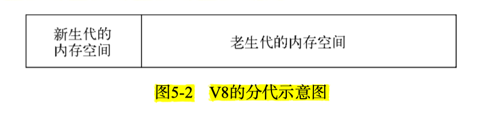
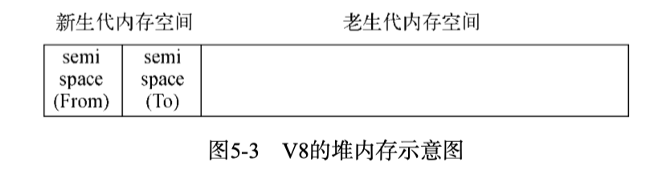
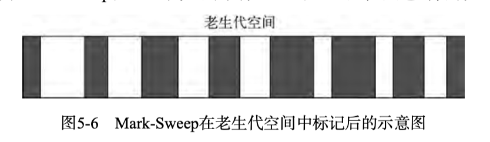
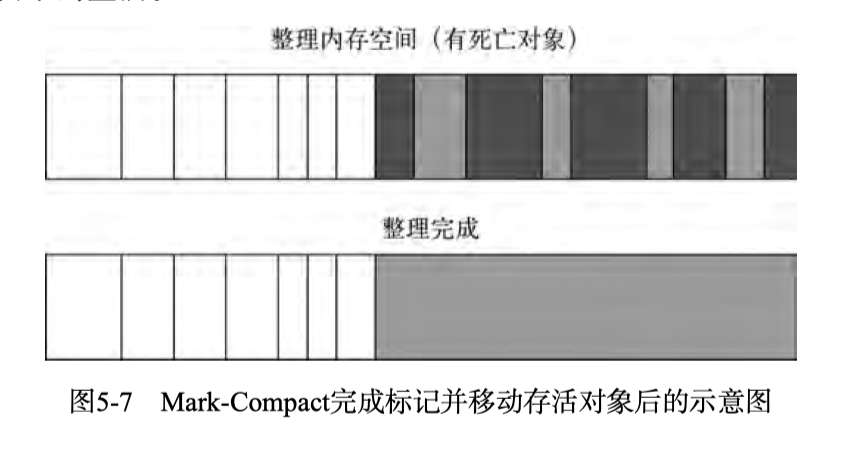

# 内存管理

## V8的内存限制
### V8的内存分配

因为V8本身是面向浏览器设计的，所以在内存使用上进行了限制，主要表现为：64位系统，默认最大分配1.4G，32位系统，默认分配0.7G
在Node中，可以在启动时手动指定分配的内存空间大小：
```
node --max-old-space-size=1700 test.js // 单位为MB 
// 或者
node --max-new-space-size=1024 test.js // 单位为KB
```

### V8的垃圾回收机制

因为在实际的应用中，对象的生命周期长短不一，为了高效地处理垃圾回收，V8主要采用分代式垃圾回收算法：
在V8中，主要将对象分为新生代和老生代，在上面的分配内存的指令中，分别指定的是老生代和新生代的内存。新生代中的对象为存活时间较短的对象，老生代的中的对
象为存活时间较长或常驻内存的对象。如下图所示


#### 1.Scavenge算法
`Scavenge`算法主要采用了`Cheney`算法，`Cheney`是一种采用复制的方式实现的垃圾回收算法。它将堆内存一分为二，每一部分空 间称为semispace。在这两个semispace空间中，只有一个处于使用中，
另一个处于闲置状态。处于使用状态的`semispace`空问称为`From`空间，处于闲置状态的空问称为`To`空问。当我们分配对象时，先是在From空间中进行分配。
当开始进行垃圾回收时，会检查From空问中的存活对象，这些存活对象将被复制到To空问中，而非存活对象占用的空间将会被释放。完成复制后，
**From空间和To空间的角色发生对换**。简而言之，在垃圾回收的过程中，就是通过将存活对象在两个semispace空间之问进行复制。

**缺点**：只能使用堆内存的一半
**优点**：因为新生代的对象生命周期一般比较短，而且`Scavenge`算法只复制存活的对象，所以时间效率比较高



在分代式垃圾回收机制的前提下，满足条件的新生代对象会**晋升**至老生代空间中，条件如下：
1. 对象从`From`空间中复制到`To`空间时，会检查它的内存地址来判断这个对象**是否已经经历过一次Scavenge回收**。
   如果己经经历过了，会将该对象从`From`空问复制到老生代空间中，如果没有，则复制到`To`空间中。
2. 另一个判断条任是`To`空间的内存占用比。当要从`From`空同复制一个对象到`To`空间时，
   **如果To空间已经便用了超过25%，则这个对象直接晋升到老生代空间中**。 
   

#### Mark-Sweep和Mark-Compact

因为老生代中对象存活时间一般比较长，采用`Scavenge`算法循环复制存活对象的做法会导致性能较差，所以与Scavenge算法相反，
Mark-Sweep采用的是**标记清除法**，只清除死亡的对象。标记清除分为标记和清除两步，在标记阶段，遍历堆内存中的对象，
给存活的对象打上标记，在随后的清除阶段对将没有标记的对象内存释放，因为死亡对象只占老生代空间的小部分，存活对象只占新生代空间的小部分，
这是两种算法高效的原因。

使用 `Mark-Sweep`清理后的内存如5-6所示，其中黑色和白色分别表示死亡和存活的对象，可以发现内存不再连续，对后续的内存使用埋下了隐患，
如果此时需要存储一个大对象，所有的碎片内存的空间都不够大，会导致存储失败。




为了解决**碎片内存**的问题，V8使用了 `Mark-Compact`算法对 `Mark-Sweep` 进行了优化，在清理完死亡对象后，将所有存活的对象向内存一端移动
，移动完成后释放掉边界外的内存，效果如下图所示



| 回收算法 | Mark-Sweep | Mark-Compact | Scavenge |
| :---- | :----: | :----: | :----: |
| 速度 | 中等 | 最慢 | 最快 |
| 空间开销 | 少（有碎片）| 少（无碎片） | 双倍空间|
| 是否移动对象 | 否 | 是 | 是 |

考虑到执行效率，V8主要使用 `Mark-Sweep`，在空间不足以存放新生代晋升过来的对象时才使用 `Mark-Compact`。
